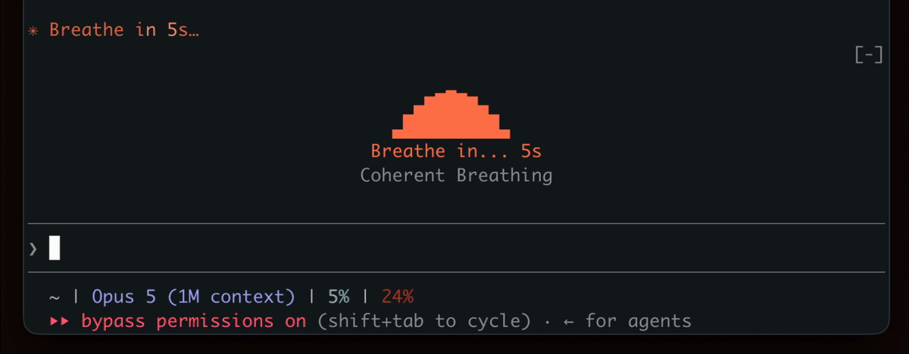

# Mindful Claude

Breathe while Claude works.

Every prompt you send gives you 10 to 60+ seconds of waiting. This Claude Mod turns that time into a guided breathing exercise. When Claude starts working, a breathing animation appears above the prompt and the spinner counts the breath with you. When Claude answers, it's gone.



## Why

Slow breathing at about 5.5 breaths per minute raises heart rate variability (HRV), a marker of stress resilience. Even short sessions lower cortisol and sharpen focus. Every Claude turn becomes a micro-session, and you never leave the terminal.

## Fork changes

Changes on top of upstream 2.0.0. Each is off by default except the default exercise.

- **The default exercise is now `box`** (4-4-4-4) rather than `hrv`.
- **A breath finishes its cycle.** Upstream hides the band the moment the turn ends, which can cut an animation off mid-inhale. Here the band stays until the breath in progress completes, then goes. Worst case is one extra cycle.
- **`/breathe confirm on`** asks `Start now` / `Skip` (keys `s` / `k`) before the breath begins. Pressing nothing starts it — a choice not made is a start.
- **`/breathe pause` is a button in the band** (key `p`), and it really stops the animation: the Client's frame timer is cancelled, so the breath holds where it is. Time spent paused is not counted as breathing.
- **Breathing time is recorded.** Each breath logs its length to the transcript and adds to a total that persists across sessions; `/breathe totals` reads it.
- **`/breathe review on`** asks how the breath felt when it ends.
- **`/breathe schedule`** picks the exercise per turn: `fixed` (default), `random`, or `day` — the last reads a weekly table in `hooks/breath/exercises.ts` (`WEEK`), editable.
- **`/breathe quiet on`** hides the work while the breath is up: no tool rows, no command output, no assistant text, only the animation. The rows come back as they were when the breath ends; nothing is lost from the turn's record.

## Keys

The band draws its buttons, so a mouse works. A hotkey only fires once the band
holds the focus, which `ctrl+x tab` gives it — press it, then `s` / `k` / `p`.

## Install

Needs Claude Code 2.1.269 or later. Claude Mods are in early access, so turn them on in `~/.claude/settings.json`:

```json
{
  "env": {
    "CLAUDE_CODE_ENABLE_FUNCTION_HOOKS": "1"
  }
}
```

Then:

```sh
claude plugin marketplace add halluton/Mindful-Claude
claude plugin install mindful-claude@mindful-claude
```

Start `claude`, send a prompt, breathe.

To remove it: `claude plugin uninstall mindful-claude`.

## `/breathe`

| Command | What it does |
|---|---|
| `/breathe` | Show the current settings |
| `/breathe off` / `on` | Hide or show the band |
| `/breathe hrv` | Coherent Breathing: 5.5s in, 5.5s out |
| `/breathe sigh` | Physiological Sigh: double inhale, long exhale |
| `/breathe box` | Box Breathing: 4s in, 4s hold, 4s out, 4s hold |
| `/breathe 478` | 4-7-8 Breathing: 4s in, 7s hold, 8s out |
| `/breathe style wave` | Pin a style: `pulse`, `ripples`, `dots`, `wave`, or `random` |
| `/breathe delay 5` | Seconds into a turn before the band appears (default 0) |
| `/breathe spinner off` | Leave the spinner alone |

Settings persist across sessions.

| Exercise | Best for |
|---|---|
| **Coherent Breathing** | Sustained HRV improvement |
| **Physiological Sigh** | Quick calm-down |
| **Box Breathing** | Focus and concentration |
| **4-7-8 Breathing** | Deep relaxation |

## How it works

A [Claude Mod](https://github.com/anthropics/claude-code/issues/91870) is a plugin whose hooks are TypeScript functions running inside Claude Code. This one costs zero tokens: the model never sees it.

- `hooks/register.tsx` hooks `ui.render` for the band above the prompt and mounts the animation while the engine says a turn is working. It also rewrites the spinner's word with the current phase and registers `/breathe`.
- `hooks/breathe.tsx` is the animation, drawn ten times a second on the surface's own clock.
- `hooks/breath/` holds the exercises, easing and shapes as pure functions, covered by `bun test`.

## Develop

```sh
git clone https://github.com/halluton/Mindful-Claude
cd Mindful-Claude
claude --plugin-dir .      # loads from disk, hot-reloads on save
bun test
```

For type checking, run `/plugin-types` in that session, then `bunx -p typescript tsc -p .`.

The original bash and tmux version lives in [`legacy/`](legacy/).

## License

MIT. See [LICENSE](LICENSE).
